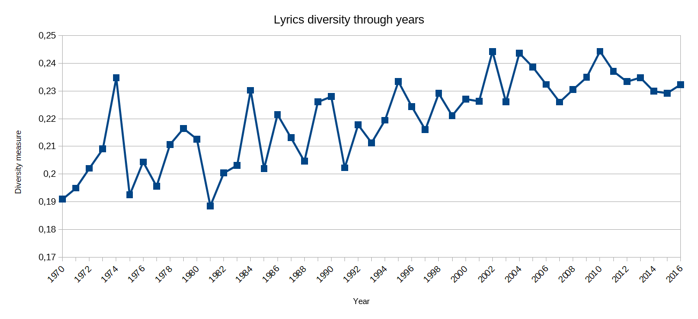

# song-diversity
Clustering the embedding space of words to determine the diversity of songs based on their lyrics.

### Getting it to work
Download:
* lyrics.csv dataset (or any): https://www.kaggle.com/gyani95/380000-lyrics-from-metrolyrics
* glove.6B.50d.txt word embeddings (or any): https://nlp.stanford.edu/projects/glove/

Add both files to the main folder, run preprocess_dataset.py, run diversity.py, done.

### Description

Fortunately, Art is a strongly subjective matter. But humans are always trying to categorize everything. That's probably why we find machine learning so appealing. This code brings a measure of word diversity in a document, applied to song lyrics. There is so much room for improvement, but it is a nice example of the ability of embedding spaces for text understanding.

My diversity measure is based on the following assumption: **diverse words will occupy diverse positions in the embedding space**. Then, the more sparsed the words of the document are, the more diverse the document should be. To measure this sparsity, I perform K-Means clustering on a large embedding space that contains many words, taken from pre-trained embeddings, and count the percentage of clusters that contain at least one word of the lyrics of a song. If most words are in the same few clusters, diversity will fall, and vice versa.

### Some examples

Genre diversity:
* Hip-Hop 0.3957430882530501
* Metal 0.2357001557304587
* Indie 0.2178659892029223
* Country 0.21524223257106967
* Pop 0.21406717247854676
* Folk 0.21400089206066006
* Rock 0.21358054109536684
* R&B 0.21103793002058252
* Not Available 0.20735424880462608
* Jazz 0.19468448124452248
* Electronic 0.18900941619586145

A simple run on a medium-size corpus and small-size embeddings yields these results of diversity aggregated by genre. They are interesting because Hip-Hop is, by a large margin, the winner in diversity, which kind of makes sense because it is a genre strongly based on vocals. At the end, results also make sense because many songs in Jazz and in Electronic music are mainly instrumental. In between, everything is around 21% with few differences. If I were to find a hypothesis for that, I would say that all those genres are mainly derivates from the Pop-Rock area, so they could be lyrically similar.

Year diversity:

If we aggregate songs diversity by years, there is a trend upside that is promising. Are lyrics really getting _better_ with time? It would be interesting to split this plot into genres, to see if there is a correlation between both (e.g. genres with more vocals more popular nowadays than in the past).

### Caveats
* The measure could be very correlated with the length of the lyrics and should be adjusted in that sense.
* Results will change a lot depending on the embedding space used for clustering. Probably none is perfect, but a good one should ideally have many different words, both from the world of lyrics and from other fields.

